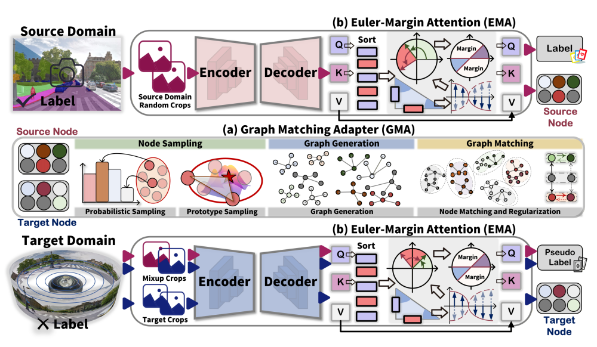

<div align="center">


<h1><b>Seeing Beyond: Extrapolative Domain Adaptive Panoramic Segmentation</b></h1>



<p>
<a href="https://github.com/zyfone/EDA-PSeg"></a>
<a href="https://github.com/zyfone/EDA-PSeg/network/members"></a>
<a href="https://github.com/zyfone/EDA-PSeg/commits/main"></a>

</p>

<p>
  <a href="https://arxiv.org/abs/2603.15475"><strong>📄 Paper: Seeing Beyond – Extrapolative Domain Adaptive Panoramic Segmentation</strong></a>
</p>


<p>
  <a href="https://github.com/zyfone/">Yuanfan Zheng<sup>1</sup></a>, 
  <a href="https://scholar.google.com/citations?user=pA9c0YsAAAAJ&hl=en">Kunyu Peng<sup>2</sup></a>, 
  <a href="https://zhengxujosh.github.io/">Xu Zheng<sup>3</sup></a>, 
  <a href="https://yangkailun.com/">Kailun Yang*<sup>1</sup></a>
</p>

<p>
<sup>1</sup>Hunan University &nbsp;·&nbsp;
<sup>2</sup>IAR, Karlsruher Institut für Technologie &nbsp;·&nbsp;
<sup>3</sup>Hong Kong University of Science and Technology (HKUST)
</p>


</div>

---

## 🗂️ Data Preparation

Download the following datasets:

- [Cityscapes](https://www.cityscapes-dataset.com/)
- [SynPASS](https://drive.google.com/file/d/1u-5J13CD6MXpWB53apB-L6kZ3hK1JR77/view?usp=sharing)
- [DensePASS (WildPASS2K + DensePASS)](https://github.com/chma1024/DensePASS)
- [ACDC](https://acdc.vision.ee.ethz.ch/)
- [GTA](https://download.visinf.tu-darmstadt.de/data/from_games/)

---

### 🔧 Data Preprocessing

Convert label IDs and generate class indices for RCS:

```bash
# =================================================================================
# 1. Open-Set PIN2PAN (Cityscapes, WildPASS2K -> DensePASS)
# =================================================================================

# Source Domain (Cityscapes)
python tools/convert_datasets_pass/cityscapes_13_train.py /path/to/Cityscapes --nproc 8

# Target Domain (WildPASS2K - Empty Label)
python tools/convert_datasets_pass/target_empoty.py /path/to/WildPASS2K --nproc 8

# Test Domain (DensePASS)
python tools/convert_datasets_pass/DensePASS_13.py /path/to/DensePASS --nproc 8


# =================================================================================
# 2. Open-Set SynPASS, WildPASS2K -> DensePASS
# =================================================================================

# Source Domain (SynPASS)
python tools/convert_datasets_pass/SynPASS_13.py /path/to/SynPASS --nproc 8 --split train --mapping train

# Test Domain (DensePASS)
python tools/convert_datasets_pass/DensePASS_11.py /path/to/DensePASS --nproc 8


# =================================================================================
# 3. Open-Set GTA → SynPASS
# =================================================================================

# Source Domain (GTA5)
python tools/convert_datasets_pass/gta_13.py /path/to/GTA5 --nproc 8

# Test Domain (SynPASS Val & Test)
python tools/convert_datasets_pass/SynPASS_13.py /path/to/SynPASS --nproc 8 --split val --mapping test
python tools/convert_datasets_pass/SynPASS_13.py /path/to/SynPASS --nproc 8 --split test --mapping test


# =================================================================================
# 4. Open-Set SynPASS → ACDC
# =================================================================================

# ACDC Dataset (Train, Val & Test)
python tools/convert_datasets_pass/ACDC_13.py /path/to/ACDC --nproc 8 --split train
python tools/convert_datasets_pass/ACDC_13.py /path/to/ACDC --nproc 8 --split val
python tools/convert_datasets_pass/ACDC_13.py /path/to/ACDC --nproc 8 --split test
```

---

## 🧩 Environment Setup

```bash
pip install torch==2.0.0 torchvision==0.15.1 torchaudio==2.0.1 --index-url https://download.pytorch.org/whl/cu118
pip install -r requirements.txt 
```

### Build MMCV from Source

```bash
# Download mmcv-1.3.7.zip
wget https://github.com/zyfone/EDA-PSeg/releases/download/0.0/mmcv-1.3.7.zip
unzip mmcv-1.3.7.zip
cd mmcv-1.3.7
pip install -e . -v
```

---

## 🚀 Training

```bash
# Cityscapes → DensePASS
CUDA_VISIBLE_DEVICES=0 python run_experiments.py --config configs/daformer/city2dense_uda_openset_graph.py

# SynPASS → DensePASS
CUDA_VISIBLE_DEVICES=0 python run_experiments.py --config configs/daformer/syn2dense_uda_openset_graph.py

# GTA → SynPASS
CUDA_VISIBLE_DEVICES=0 python run_experiments.py --config configs/daformer/gta2syn_uda_openset_graph.py

# SynPASS → ACDC
CUDA_VISIBLE_DEVICES=0 python run_experiments.py --config configs/daformer/syn2acdc_uda_openset_graph.py
```

---

## 🏋️ Model Weights Setup

### 1. Download Pretrained Weights

```bash
# MiT-B5 Weights
wget https://github.com/zyfone/EDA-PSeg/releases/download/0.0/mit_b5.pth

# MobileSAM Weights
wget https://github.com/zyfone/EDA-PSeg/releases/download/0.0/mobile_sam.pt
```

---

### 2. Configure MiT-B5 in DAFormer

**File:** `configs/_base_/models/daformer_conv1_mitb5.py`

```python
model = dict(
    type='EncoderDecoder',
    pretrained='/path/mit_b5.pth',  # Path to MiT-B5 weights
)
```

---

### 3. Set MobileSAM Checkpoint in DACS

**File:** `mmseg/models/uda/dacs.py`

```python
# Load MobileSAM checkpoint
sam_checkpoint = "/path/mobile_sam.pt"  # Path to MobileSAM weights
```


## Training

```bash
# Cityscapes → Dense
CUDA_VISIBLE_DEVICES=0 python run_experiments.py --config configs/daformer/city2dense_uda_openset_graph.py

# # Synth → Dense
CUDA_VISIBLE_DEVICES=0 python run_experiments.py --config configs/daformer/syn2dense_uda_openset_graph.py 

# # GTA → Synth
CUDA_VISIBLE_DEVICES=0 python run_experiments.py --config configs/daformer/gta2syn_uda_openset_graph.py 

# # Synth → ACDC
CUDA_VISIBLE_DEVICES=0 python run_experiments.py --config configs/daformer/syn2acdc_uda_openset_graph.py
```
---

## 🧪 Testing & Predictions

```bash
python -m tools.test ${CONFIG_FILE} ${CHECKPOINT_FILE} \
  --eval h_score --show-dir ${SHOW_DIR} --opacity 1
```

---

## 🧠 Proposed Components

### 🔹 Graph Matching Adapter (GMA)
- **Path:** `mmseg/models/decode_heads/daformer_head_graph.py`
- **Key Functions:**  
  `node_sample()` → `_node_completion()` → `update_seed()` → `_forward_aff()` → `_forward_qu()`

### 🔹 Euler-Margin Attention (EMA)
- **Path:** `mmseg/models/decode_heads/euler_margin.py`
- **Key Functions:**  
  `Euler_Attention()` → `EulerFormer()` → `NeuralSort()`

---

## 🔗 Related Repositories

Our work builds upon and integrates ideas from:

- [DAFormer](https://github.com/lhoyer/DAFormer)
- [BUS](https://github.com/KU-VGI/BUS)
- [Trans4PASS](https://github.com/InSAI-Lab/Trans4PASS)
- [EulerFormer](https://github.com/RUCAIBox/EulerFormer)
- [SIGMA](https://github.com/CityU-AIM-Group/SIGMA)

---

## 📫 Contact

For questions or collaboration:
**Email:** [478756030@qq.com](mailto:478756030@qq.com)


## 🤝 Publication:
Please consider referencing this paper if you use the ```code``` or ```data``` from our work.
Thanks a lot :)

```BibTeX
@inproceedings{zheng2026seeing,
  title={Seeing Beyond: Extrapolative Domain Adaptive Panoramic Segmentation},
  author={Zheng, Yuanfan and Peng, Kunyu and Zheng, Xu and Yang, Kailun},
  booktitle={2026 IEEE/CVF Conference on Computer Vision and Pattern Recognition (CVPR)},
  year={2026}
}
```


<div align="center">
⭐️ Star this repo if you find it useful, your support means a lot! ⭐️  
</div>

